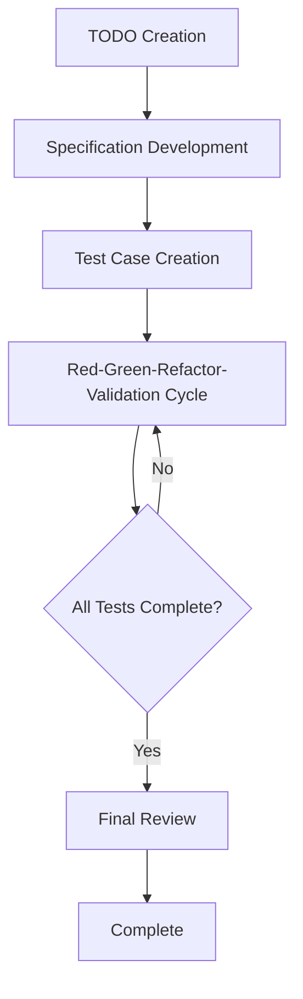

# 3.1 Extended TDD Process Overall Flow

## AITDD Process Overview

AITDD is an extended development methodology that combines the power of AI with traditional TDD (Test-Driven Development), adding a **Validation** step. Through human-AI collaboration, high-quality software can be developed efficiently.

## Overall Flow Structure



### Basic Process Flow

```
TODO Creation → Specification Development → Test Case Creation → Red-Green-Refactor-Validation → Final Review
```

## Detailed Steps

### 1. TODO Creation (Human Responsibility)

**Purpose**: Clearly define development tasks and divide them into appropriate work units

**Work Content**:
- Identify functional requirements
- Break down development tasks
- Set priorities
- Clarify work scope

**Deliverables**: TODO.md file
- Task list in specific, implementable units
- Priority and dependencies for each task
- Definition of completion criteria

### 2. Specification Development (Human Responsibility & Review Required)

**Purpose**: Develop detailed technical specifications from TODOs

**Work Content**:
- Define detailed functional specifications
- Clarify inputs and outputs
- Establish error handling policies
- Set performance requirements

**Important Points**:
- **Human review is mandatory**
- Use AI suggestions as reference while humans make final decisions
- Eliminate specification ambiguities

**Deliverables**: requirements.md file
- Detailed functional requirements
- Technical constraints
- Quality requirements

### 3. Test Case Creation (Human Responsibility & Review Required)

**Purpose**: Design comprehensive test cases based on specifications

**Work Content**:
- Design normal case test scenarios
- Design error case test scenarios
- Plan boundary value testing
- Identify edge cases

**Important Points**:
- **Human review is mandatory**
- Ensure test case comprehensiveness
- Verify consistency with specifications

**Deliverables**: testcases.md file
- List of test cases
- Details of expected behavior
- Test data definitions

### 4. Red-Green-Refactor-Validation Cycle (Primarily AI Responsibility)

We've extended the traditional TDD cycle by adding a **Validation** step. This cycle is executed almost entirely by AI, but under human supervision.

#### Red (Test Failure)
- Test case implementation
- Verify expected failures
- Execute tests and confirm failures

#### Green (Minimal Implementation)
- Minimal implementation to pass tests
- Automatic code generation by AI
- Confirm test success

#### Refactor (Refactoring)
- Improve code quality
- Optimization by AI
- Enhance readability and maintainability

#### Validation (Verification)
- Validate implementation appropriateness
- Quality checks
- Verify additional validation items

### 5. Final Review (Human Responsibility)

**Purpose**: Final confirmation of overall generated code quality and specification compliance

**Work Content**:
- Detailed source code review
- Verify consistency with specifications
- Security checks
- Performance verification

**Important Points**:
- **Must be performed by humans**
- Final quality assurance for AI-generated code
- Last line of defense before production deployment

## Role Division Between AI and Humans

### Areas AI (Claude, etc.) Handles

- **Red-Green-Refactor-Validation Cycle Execution**
  - Test case implementation
  - Production code generation
  - Refactoring execution
  - Quality verification support

- **Code Generation and Optimization**
  - Efficient algorithm implementation
  - Implementation following coding standards
  - Automatic code improvement

- **Automated Test Execution**
  - Test execution and result verification
  - Test coverage measurement
  - Continuous quality checks

### Areas Humans Handle

- **Strategic Decisions**
  - Specification development and review
  - Test case design and review
  - Architecture decisions

- **Quality Management**
  - Final source code review
  - Security requirement verification
  - Business requirement compliance verification

- **Creative Work**
  - Problem-solving approach decisions
  - User experience design
  - Technology choice decisions

## Comparison with Traditional TDD

| Item | Traditional TDD | AITDD |
|------|---------|--------|
| **Cycle** | Red-Green-Refactor | Red-Green-Refactor-**Validation** |
| **Implementation Lead** | Human | **AI** (Under human supervision) |
| **Review** | Only after implementation | **Specification, Tests, Final Code** |
| **Speed** | Depends on human implementation speed | **Significantly accelerated with AI assistance** |
| **Quality Management** | Depends on developer skills | **Multi-layered quality checks** |
| **Learning Cost** | TDD mastery required | **TDD + AI utilization skills** |

## Process Benefits

### 1. Improved Development Speed
- Significantly reduced implementation time through AI automatic code generation
- Automation of repetitive tasks
- Accelerated test execution and feedback

### 2. Improved Quality
- Additional quality checks through Validation step
- Dual-check system with humans and AI
- Consistent quality standard application

### 3. Knowledge Utilization
- AI utilization of latest technologies and best practices
- High-quality code generation even for inexperienced developers
- Automatic utilization of domain knowledge

### 4. Continuous Improvement
- Learning effects through AI feedback
- Continuous optimization of the process itself
- Skill improvement for entire team

## Precautions and Risk Management

### 1. Avoid Excessive AI Dependency
- Important decisions must always be made by humans
- Don't blindly accept AI suggestions
- Continuously deepen technical understanding

### 2. Strengthen Quality Management
- Implement reviews at multiple stages
- Combine automated and manual testing
- Ensure thorough security requirement verification

### 3. Process Flexibility
- Adjust process according to project needs
- Apply according to team skill levels
- Continuous process improvement

## Next Steps

In Chapter 3, we'll explain each step of this process in detail:

- [3.2 TODO Creation and Specification Development](./02-todo-and-specification.md)
- [3.3 Test Case Creation](./03-test-case-creation.md)
- [3.4 Red-Green-Refactor-Validation Cycle](./04-rgr-validation-cycle.md)
- [3.5 Validation Step Details](./05-validation-details.md)

Let's learn specific procedures and techniques for each step and become able to actually practice AITDD.
