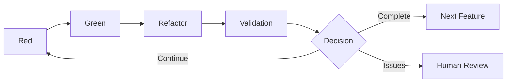

# 3.5 Validation Step Details

## Position of the Validation Step

The Validation step is one of the most important innovations in AITDD. This step, added to the traditional TDD Red-Green-Refactor cycle, automates quality assurance and completion determination for AI-generated code, realizing a more reliable development process.

## Purpose of the Validation Step

### 1. Multi-layered Quality Assurance
- **Functional requirement fulfillment**: Planned features are correctly implemented
- **Regression prevention**: No adverse effects on existing functionality
- **Code quality**: Maintainable, high-quality code is generated

### 2. Automated Completion Determination
- Objective criteria-based completion determination
- Pre-filtering before human review
- Continuous quality monitoring

### 3. Process Improvement Feedback
- Understanding AI-generated code quality trends
- Information gathering for prompt improvements
- Development efficiency measurement and optimization

## Validation Step Execution Timing



## Specific Work Procedures

### 1. Existing Test Green State Verification

#### Prerequisites
All existing tests must be passing as a prerequisite.

```bash
# Test execution
$ npm test

# Expected results
✅ User Authentication › should login with valid credentials
✅ User Authentication › should reject invalid password  
✅ User Registration › should create user with valid data
✅ User Registration › should reject duplicate email
✅ Product Management › should create product
✅ Product Management › should list products

Tests: 6 passed, 6 total
Time: 2.341s
Coverage: 94%
```

#### Response to Failures
```markdown
❌ Response when test failures exist

1. Identify failure causes
   - Impact of new implementation on existing functionality
   - Test data conflicts
   - Environment-dependent issues

2. Implement fixes
   - Fix problematic code
   - Adjust test data
   - Review environment settings

3. Verify through re-execution
   - Re-run all tests
   - Continue Validation after confirming success
```

### 2. TDD Memo Files and Requirements Document Verification

#### Target Files for Verification
```markdown
## Document Verification List

### Required Files
- doc/implementation/{feature_name}-requirements.md
- doc/implementation/{feature_name}-testcases.md  
- doc/todo.md

### Optional Files (if they exist)
- doc/implementation/{test_case_name}-memo.md
- doc/implementation/{feature_name}-architecture.md
```

#### Verification Content Example
```markdown
# User Registration Feature Requirements Verification

## Extraction from requirements.md
### Planned Features
- [x] New user registration with email/password
- [x] Duplicate email validation  
- [x] Password strength check
- [x] Password hashing (bcrypt)
- [ ] Rate limiting (100 requests/sec) ← Not implemented

### Extraction from testcases.md  
### Planned Test Cases: 10 cases
- TC001: Normal user registration
- TC002: Duplicate email error
- TC003: Password mismatch error
- TC004: Invalid email format
- TC005: Insufficient password strength
- TC006: Missing required fields
- TC007: Boundary value test - Email length
- TC008: Rate limiting test
- TC009: Database connection error
- TC010: CSRF token verification
```

### 3. Implemented Test Cases Verification

#### Test File Analysis
```javascript
// Analysis example of __tests__/user-registration.test.js

describe('User Registration', () => {
  // Verification of implemented test cases
  test('TC001: should create user with valid data', async () => {
    // Implemented ✅
  });
  
  test('TC002: should reject duplicate email', async () => {
    // Implemented ✅
  });
  
  test('TC003: should reject password mismatch', async () => {
    // Implemented ✅
  });
  
  test('TC004: should validate email format', async () => {
    // Implemented ✅
  });
  
  test('TC005: should validate password strength', async () => {
    // Implemented ✅
  });
  
  test('TC006: should require all fields', async () => {
    // Implemented ✅
  });
  
  test('TC007: should handle email length limits', async () => {
    // Implemented ✅
  });
  
  test('TC010: should verify CSRF token', async () => {
    // Implemented ✅
  });
  
  // TC008, TC009 are not implemented
});
```

#### Implementation Status Summary
```markdown
## Test Case Implementation Status

### Implemented: 8 cases
- TC001: Normal user registration ✅
- TC002: Duplicate email error ✅
- TC003: Password mismatch error ✅
- TC004: Invalid email format ✅
- TC005: Insufficient password strength ✅
- TC006: Missing required fields ✅
- TC007: Boundary value test ✅
- TC010: CSRF token verification ✅

### Not implemented: 2 cases
- TC008: Rate limiting test ❌
- TC009: Database connection error ❌

### Implementation rate: 80% (8/10)
```

### 4. Implementation Status Analysis and TODO.md Update Decision

#### AI Quality Risk Assessment

```markdown
## AI Analysis Report Example

### Implementation Completion Assessment
- Basic function implementation rate: 100%
- Test case implementation rate: 80% 
- Requirements fulfillment rate: 90%

### Importance Analysis of Unimplemented Items
#### TC008: Rate Limiting Test
- Importance: Medium (Security-related)
- Impact scope: Production environment abuse risk
- Implementation priority: Medium

#### TC009: Database Connection Error
- Importance: High (Availability-related)
- Impact scope: Overall system stability
- Implementation priority: High

### Quality Risk Assessment
- Security risk: Medium (Rate limiting not implemented)
- Availability risk: High (Unknown behavior during DB failures)
- Maintainability risk: Low (Good code quality)

### Recommended Actions
1. Priority implementation of TC009 (DB connection error)
2. Consider next-phase implementation of TC008 (Rate limiting)
3. Can proceed to next step but requires caution
```

## Validation Decision Criteria

### ✅ Fully Implemented (Automatic progression to next step)

```markdown
### Completion Conditions
- Existing test status: All green ✅
- Test case implementation rate: 100% ✅
- Critical function completion rate: 100% ✅
- Quality risk: None ✅
- Security check: Pass ✅

### Automatic Decision Result
🎉 Implementation complete - Automatic progression to next requirements definition step
```

### ⚠️ Implementation Insufficient (Additional implementation required)

```markdown
### Continuation Conditions (Example 1: Major unimplemented items)
- Existing test status: All green ✅
- Test case implementation rate: 70% ❌
- Critical function completion rate: 80% ❌
- Quality risk: High-risk items present ❌

### Decision Result
⚠️ Additional implementation required - Return to Red step to add unimplemented items

### Continuation Conditions (Example 2: Existing test failures)
- Existing test status: Failures present ❌
- Test case implementation rate: 90% ✅
- Critical function completion rate: 95% ✅

### Decision Result  
❌ Regression test failure - Return to Green/Refactor step for fixes
```

### 🔍 Requires Judgment (Human review required)

```markdown
### Cases Difficult to Judge
- Test case implementation rate: 85% (Boundary value)
- Unimplemented items: Difficult to judge importance
- Quality risk: Organization-specific judgment required
- Business requirements: Ambiguity in specification interpretation

### Decision Result
🔍 Human review requested - Expert knowledge judgment required
```

## AI Decision Process

### 1. Information Gathering and Analysis

#### Input Information
```markdown
## Input Data for Validation Execution

### Technical Information
- Test execution results (success/failure details)
- Code coverage reports
- Static analysis results (ESLint, TypeScript, etc.)
- Performance test results

### Specification Information  
- requirements.md (functional and non-functional requirements)
- testcases.md (test case list)
- architecture.md (architecture design)

### Project Information
- Existing codebase
- Dependency information
- Environment configuration
```

#### Analysis Methods
```markdown
## AI Analysis Approach

### 1. Quantitative Analysis
- Test case implementation rate calculation
- Code coverage evaluation
- Complexity metrics measurement
- Performance indicator verification

### 2. Qualitative Analysis  
- Requirements and implementation consistency verification
- Subjective code quality evaluation
- Security requirement checks
- Maintainability evaluation

### 3. Risk Assessment
- Impact analysis of unimplemented features
- Security risk evaluation
- Operational risk evaluation
- Technical debt evaluation
```

### 2. Decision Logic

#### Hierarchical Decision System
```markdown
## Decision Priority Order

### Level 1: Critical Issues (Immediate continuation decision)
1. Existing test failures
2. Critical security issues
3. Data corruption risks

### Level 2: Important Feature Deficiencies (Continuation recommended)
1. Basic function not implemented
2. Important error handling insufficient
3. Required validation missing

### Level 3: Quality Standards (Threshold-based decision)
1. Test coverage < 80%
2. Test case implementation rate < 90%
3. Complexity > Tolerance level

### Level 4: Comprehensive Decision (Complete/Continue/Requires judgment)
- Final decision integrating all above
- Comparison with organizational quality standards
- Project situation consideration
```

#### Decision Prompt Example
```markdown
## Validation Decision Prompt

You are the quality decision AI for the AITDD Validation step. Please make implementation completion decisions based on the following information.

### Decision Target
- Feature: User Registration API
- Implementation results: [Code, test results, quality metrics]
- Requirements: [contents of requirements.md]
- Test cases: [contents of testcases.md]

### Decision Criteria
1. Existing tests: All must pass
2. Test case implementation rate: 90% or higher for completion
3. Critical features: 100% implementation required
4. Security: No critical issues required

### Output Format
```json
{
  "decision_result": "complete|continue|requires_judgment",
  "implementation_rate": {
    "test_cases": "80%",
    "critical_features": "100%"
  },
  "quality_evaluation": {
    "security": "pass|caution|fail",
    "performance": "good|average|needs_improvement",
    "maintainability": "high|medium|low"
  },
  "unimplemented_items": [
    {
      "item": "TC008",
      "importance": "medium|high|low", 
      "recommended_action": "immediate_implementation|next_phase_implementation|implementation_unnecessary"
    }
  ],
  "continuation_reason": "reason if decision is continuation",
  "next_action": "specific next steps"
}
```
```

## Traffic Light System for Inference Visualization

### Utilizing the Traffic Light System

The Validation step visualizes AI inference parts to improve human review efficiency.

#### 🟢 Green Light (High Confidence)
```markdown
## Content clearly inferable from source files

### Example: Test Case Implementation Status
- 🟢 TC001 implemented (corresponding test exists in test file)
- 🟢 Basic functionality verified (test success results available)
- 🟢 Error handling implemented (specified in requirements document)
```

#### 🟡 Yellow Light (Caution - Requires Verification)
```markdown  
## Content supplemented by inference but seems reasonable

### Example: Quality Assessment
- 🟡 80% code coverage is sufficient (judgment based on general standards)
- 🟡 Performance requirements not measured but no issues (inferred from implementation content)
- 🟡 Medium security risk (estimated from unimplemented rate limiting)
```

#### 🔴 Red Light (Requires Verification)
```markdown
## Content based on independent judgment not in source files

### Example: Business Decisions
- 🔴 Rate limiting implementation priority "Medium" (organizational policy unknown)
- 🔴 DB connection error handling essential (operational requirements unconfirmed)
- 🔴 Next phase implementation sufficient (project schedule unknown)
```

### TODO Format Management

```markdown
## Validation Results TODO

### 🟢 High Confidence Items (Verification recommended)
- [ ] Confirm TC001-007 implementation completion from [testcases.md](./testcases.md)
- [ ] Confirm 100% basic functionality implementation from [requirements document](./requirements.md)

### 🟡 Medium Confidence Items (Requires verification)
- [ ] Verify performance characteristics of [implementation code](./src/users.js)
- [ ] Verify [security requirements](./requirements.md) compliance

### 🔴 Requires Judgment Items (Important)
- [ ] Detailed verification: Judge implementation priority of [unimplemented items](./testcases.md) by organizational standards
- [ ] Detailed verification: Confirm [operational requirements](./requirements.md) for DB failure scenarios
- [ ] Detailed verification: Adjust implementation plan based on project schedule
```

## Validation Step Optimization

### 1. Accuracy Improvement through Prompt Enhancement

#### Improvement Points
```markdown
## Points for Prompt Quality Improvement

### 1. Clarification of Decision Criteria
- Specification of numerical standards (80% coverage or higher, etc.)
- Detailed priority decision rules
- Reflection of organization-specific standards

### 2. Enrichment of Context Information
- Provision of project background
- Relationship with existing systems
- Operational environment constraints

### 3. Standardization of Output Format
- Structured output in JSON format
- Utilization of traffic light system
- Issue organization in TODO format
```

#### Prompt Template Evolution
```markdown
## Gradual Prompt Improvement

### v1.0: Basic Version
- Basic decision functionality
- Simple complete/continue decision

### v2.0: Detailed Version
- Added quality metrics evaluation
- Enhanced risk evaluation functionality
- Introduced traffic light system

### v3.0: Organization-Optimized Version  
- Incorporation of organization-specific standards
- Consideration of project characteristics
- Improvement through learning data
```

### 2. Automation Scope Expansion

#### Current Automation Level
```markdown
## Current State of Automation

### Fully Automated
- Test execution and result collection
- Basic quality metrics measurement
- Standard decisions (with clear criteria)

### Semi-automated (Human confirmation required)
- Importance decisions (business perspective)
- Security risk evaluation
- Architecture impact evaluation

### Manual Response Required
- Organizational policy consistency verification
- Project-specific situation consideration
- Stakeholder coordination
```

#### Automation Expansion Direction
```markdown
## Future Automation Plans

### Short-term (1-3 months)
- Quality standard customization functionality
- Learning functionality based on past performance
- Automatic report generation functionality

### Medium-term (3-6 months)
- Learning organization-specific rules
- Automatic consideration of project characteristics
- Stakeholder notification automation

### Long-term (6+ months)
- Predictive quality management
- Automatic process optimization
- Team learning integration
```

## Common Issues and Solutions

### Issue 1: Decision Criteria Are Ambiguous

**Symptoms**: 
- Completion/continuation decisions are inconsistent
- Discrepancy between human and AI decisions

**Causes**:
- Organization-specific quality standards undefined
- Ambiguity in decision rules

**Solutions**:
```markdown
### Clarification of Decision Criteria
1. Setting numerical standards
   - Test coverage: 80% or higher
   - Test case implementation rate: 90% or higher
   - Critical function completion rate: 100%

2. Documentation of quality standards
   - Security requirement checklist
   - Performance tolerance values
   - Code quality standards

3. Definition of exception handling rules
   - Consideration of project-specific circumstances
   - Standard relaxation during emergency releases
   - Technical debt tolerance levels
```

### Issue 2: Human Review Bottleneck

**Symptoms**:
- Frequent "requires judgment" in Validation
- Increased human review wait time

**Causes**:
- Insufficient AI decision accuracy
- Insufficient organizational rule learning

**Solutions**:
```markdown
### AI Decision Accuracy Improvement
1. Learning data accumulation
   - Feedback from past decision results
   - Learning success/failure patterns
   - Reflection of organization-specific rules

2. Prompt improvement
   - More specific decision criteria
   - Enriched context information
   - Staged decision system

3. Threshold adjustment
   - Stricter automatic completion criteria
   - Clarified requires-judgment criteria
   - Improved continuation decision accuracy
```

### Issue 3: Excessive Quality Requirements

**Symptoms**:
- Many items not reaching completion decision
- Decreased development efficiency

**Causes**:
- Quality standards too strict
- Perfectionist settings

**Solutions**:
```markdown
### Balanced Quality Management
1. Staged quality standards
   - MVP (minimum implementation) standards
   - Production standards
   - Enterprise standards

2. Risk-based decisions
   - Standard adjustment according to impact level
   - Priority implementation of critical features
   - Permission to defer non-critical features

3. Continuous improvement
   - Regular standard reviews
   - Team feedback reflection
   - Performance-based optimization
```

## Summary and Next Steps

The Validation step is the cornerstone of quality assurance in the AITDD process. When operated properly, it provides:

### Benefits Achieved
- **Quality stabilization**: Consistent application of quality standards
- **Efficiency improvement**: Human review optimization
- **Continuous improvement**: Process improvement feedback loop

### Success Points
- **Clear standard setting**: Numerically quantified decision criteria
- **Staged introduction**: Staged application adapted to organization
- **Continuous optimization**: Performance-based process improvement

### Next Learning
After understanding the overall picture of the AITDD process in Chapter 3, experience AITDD hands-on in [Chapter 4 Practical Hands-On](../04-hands-on/01-first-project.md).

Through actual development, you can experience how this Validation step functions and contributes to quality improvement.
