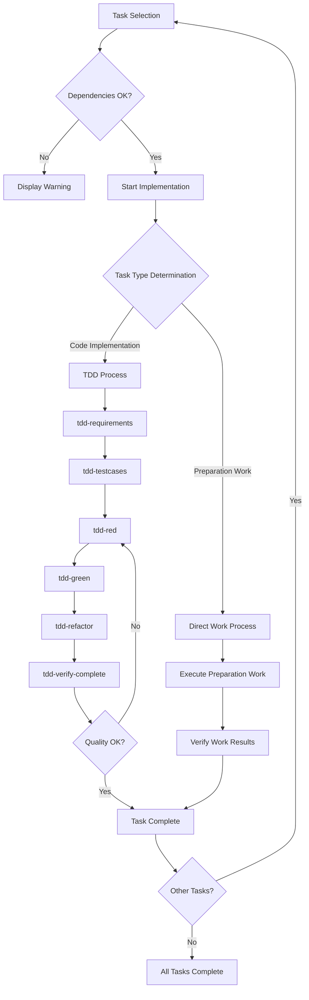

# kairo-implement

## Purpose

Implement divided tasks in order or implement user-specified tasks. Use existing TDD commands to achieve high-quality implementation.

## Prerequisites

- Task list exists in `docs/tasks/{requirement-name}-tasks.md`
- User has approved task implementation
- Existing TDD commands are available
- Implementation workspace is configured

## Execution Instructions

**【Reliability Level Instructions】**:
For each item, comment on the verification status against source materials (including EARS requirements and design documents) using these signals:

- 🟢 **Green Light**: Almost no inference when referencing EARS requirements specification and design documents
- 🟡 **Yellow Light**: Reasonable inference from EARS requirements specification and design documents
- 🔴 **Red Light**: Inference not based on EARS requirements specification and design documents

1. **Task Selection**
   - Search for specified task ID using @agent-symbol-searcher and read found task files with Read tool
   - Verify user-specified task ID
   - If not specified, automatically select next task based on dependencies
   - Display selected task details

2. **Dependency Verification**
   - Search for dependent task status using @agent-symbol-searcher and read found task files with Read tool
   - Verify if dependent tasks are completed
   - Show warning if incomplete dependent tasks exist

3. **Implementation Directory Preparation**
   - Work in current workspace
   - Verify directory structure as needed

4. **Implementation Type Determination**
   - Analyze task nature (code implementation vs preparation work)
   - Determine implementation method (TDD vs direct work)

5. **Implementation Process Execution**

   ### A. **TDD Process** (For code implementation tasks)

   a. **Requirements Definition** - `@task general-purpose tdd-requirements.md`
   ```
   Task Execution: TDD requirements definition phase
   Purpose: Describe detailed task requirements and clarify acceptance criteria
   Command: tdd-requirements.md
   Execution Method: Individual Task execution
   ```

   b. **Test Case Creation** - `@task general-purpose tdd-testcases.md`
   ```
   Task Execution: TDD test case creation phase
   Purpose: Create unit test cases and consider edge cases
   Command: tdd-testcases.md
   Execution Method: Individual Task execution
   ```

   c. **Test Implementation** - `@task general-purpose tdd-red.md`
   ```
   Task Execution: TDD red phase
   Purpose: Implement failing tests and verify that tests fail
   Command: tdd-red.md
   Execution Method: Individual Task execution
   ```

   d. **Minimal Implementation** - `@task general-purpose tdd-green.md`
   ```
   Task Execution: TDD green phase
   Purpose: Perform minimal implementation to pass tests and avoid over-implementation
   Command: tdd-green.md
   Execution Method: Individual Task execution
   ```

   e. **Refactoring** - `@task general-purpose tdd-refactor.md`
   ```
   Task Execution: TDD refactoring phase
   Purpose: Improve code quality and maintainability
   Command: tdd-refactor.md
   Execution Method: Individual Task execution
   ```

   f. **Quality Verification** - `@task general-purpose tdd-verify-complete.md`
   ```
   Task Execution: TDD quality verification phase
   Purpose: Verify implementation completeness and repeat c-f if insufficient
   Command: tdd-verify-complete.md
   Execution Method: Individual Task execution
   ```

   ### B. **Direct Work Process** (For preparation work tasks)

   a. **Preparation Work Execution** - `@task general-purpose direct-work-execute`
   ```
   Task Execution: Direct work execution phase
   Purpose: Perform directory creation, configuration file creation, dependency installation, environment setup
   Work Content:
   - Directory creation
   - Configuration file creation
   - Dependency installation
   - Environment setup
   Execution Method: Individual Task execution
   ```

   b. **Work Result Verification** - `@task general-purpose direct-work-verify`
   ```
   Task Execution: Direct work verification phase
   Purpose: Verify work completion and confirm deliverables
   Work Content:
   - Work completion verification
   - Expected deliverable confirmation
   - Next task preparation status confirmation
   Execution Method: Individual Task execution
   ```

6. **Task Completion Processing**
   - Update task status (check checkbox in task file)
   - Document implementation results
   - Suggest next task

## Execution Flow



## Command Execution Examples

```bash
# Implement all tasks in order
$ claude code kairo-implement --all

# Implement specific task
$ claude code kairo-implement --task TASK-101

# List tasks that can be executed in parallel
$ claude code kairo-implement --list-parallel

# Display current progress
$ claude code kairo-implement --status
```

## Implementation Type Determination Criteria

### TDD Process (Code Implementation Tasks)

Tasks that meet the following conditions:

- Implementation of new components, services, hooks, etc.
- Feature additions/modifications to existing code
- Business logic implementation
- API implementation

**Examples**: TaskService implementation, UI component creation, state management implementation

### Direct Work Process (Preparation Work Tasks)

Tasks that meet the following conditions:

- Project initialization・environment setup
- Directory structure creation
- Configuration file creation・updates
- Dependency installation
- Tool setup・configuration

**Examples**: Project initialization, database setup, development environment configuration

## Individual Task Execution Approach

### Task Execution Policy

By executing each implementation step as individual Tasks, the following benefits are achieved:

1. **Independence**: Each step executes independently, making error isolation easy
2. **Re-executability**: Specific steps can be re-executed individually
3. **Parallelism**: Steps without dependencies can be executed in parallel
4. **Traceability**: Execution status and results of each step are clearly recorded

### Task Execution Patterns

```bash
# For TDD process
@task general-purpose tdd-requirements.md
@task general-purpose tdd-testcases.md
@task general-purpose tdd-red.md
@task general-purpose tdd-green.md
@task general-purpose tdd-refactor.md
@task general-purpose tdd-verify-complete.md

# For direct work process
@task general-purpose direct-work-execute
@task general-purpose direct-work-verify
```

## Implementation Notes

### For TDD Process

1. **Test First**
   - Always write tests first
   - Verify tests fail before implementation

2. **Incremental Implementation**
   - Don't implement everything at once
   - Proceed in small steps

3. **Continuous Quality Verification**
   - Verify quality at each step
   - Don't create technical debt

### For Direct Work Process

1. **Staged Work Execution**
   - Execute in order considering dependencies
   - Verify completion of each step

2. **Configuration Verification**
   - Verify operation of created configuration files
   - Check environment health

3. **Documentation Updates**
   - Update documentation simultaneously with implementation
   - Ensure other developers can understand

## Output Format

### Task Start (TDD Process)

```
🚀 Starting implementation of Task TASK-101: User Authentication API

📋 Task Details:
- Requirements: REQ-101, REQ-102
- Dependencies: TASK-002 ✅
- Estimated Time: 4 hours
- Implementation Type: TDD Process

🔄 Starting TDD process...
```

### Task Start (Direct Work Process)

```
🚀 Starting implementation of Task TASK-003: Database Configuration

📋 Task Details:
- Requirements: REQ-402, REQ-006
- Dependencies: TASK-001 ✅
- Estimated Time: 3 hours
- Implementation Type: Direct Work Process

🔧 Starting preparation work...
```

### Each Step Completion (TDD)

```
✅ Task 1/6: @task tdd-requirements completed
   File: /implementation/{requirement-name}/TASK-101/requirements.md
   Task execution result: Requirements document creation completed

🏃 Task 2/6: @task tdd-testcases executing...
   Task execution: Starting TDD test case creation phase
```

### Each Step Completion (Direct Work)

```
✅ Task 1/2: @task direct-work-execute completed
   Created files: 8, Configuration updates: 3
   Task execution result: Preparation work execution completed

🏃 Task 2/2: @task direct-work-verify executing...
   Task execution: Starting direct work verification phase
```

### Task Completion (TDD)

```
🎉 Task TASK-101 completed!

✅ Updated task file checkbox
   - [ ] **Task Complete** → [x] **Task Complete**

📊 Implementation Summary:
- Implementation Type: TDD Process (Individual Task execution)
- Executed Task Steps: 6 (all successful)
- Created Files: 12
- Test Cases: 25 (all successful)
- Coverage: 95%
- Time Taken: 3 hours 45 minutes

📝 Next Recommended Tasks:
- TASK-102: User Management API
- TASK-201: Login Screen (has dependencies)

Continue implementation? (y/n)
```

### Task Completion (Direct Work)

```
🎉 Task TASK-003 completed!

✅ Updated task file checkbox
   - [ ] **Task Complete** → [x] **Task Complete**

📊 Implementation Summary:
- Implementation Type: Direct Work Process (Individual Task execution)
- Executed Task Steps: 2 (all successful)
- Created Files: 8
- Configuration Updates: 3
- Environment Check: Normal
- Time Taken: 2 hours 30 minutes

📝 Next Recommended Tasks:
- TASK-004: State Management Configuration
- TASK-101: TaskService Implementation (has dependencies)

Continue implementation? (y/n)
```

## Error Handling

- Incomplete dependent tasks: Display warning and request confirmation
- Test failures: Display detailed error information
- File conflicts: Create backup before overwriting

## Post-Execution Verification

- Display list of implemented files
- Display test result summary
- Display remaining tasks and progress rate
- Display next task suggestions
