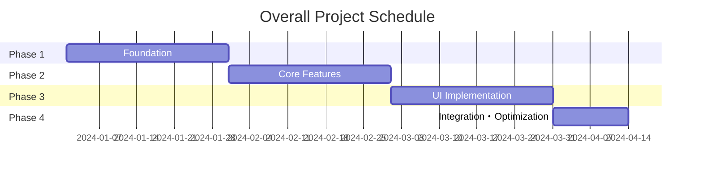

# kairo-tasks

## Purpose

Divide implementation tasks into daily granularity based on design documents and organize them into monthly phases. Create individual task files for each phase and manage them in appropriate order considering dependencies.

## Prerequisites

- Design documents exist in `docs/design/{requirement-name}/`
- Design has been approved by user (or approval is omitted)
- `docs/tasks/` directory exists (create if not present)

## Execution Instructions

**【Reliability Level Instructions】**:
For each item, comment on the verification status against source materials (including EARS requirements and design documents) using these signals:

- 🟢 **Green Light**: Almost no inference when referencing EARS requirements specification and design documents
- 🟡 **Yellow Light**: Reasonable inference from EARS requirements specification and design documents
- 🔴 **Red Light**: Inference not based on EARS requirements specification and design documents

1. **Design Document Analysis**
   - Search for design documents using @agent-symbol-searcher and read found files with Read tool
   - Read `docs/design/{requirement-name}/architecture.md` with Read tool
   - Read `docs/design/{requirement-name}/database-schema.sql` with Read tool
   - Read `docs/design/{requirement-name}/api-endpoints.md` with Read tool
   - Read `docs/design/{requirement-name}/interfaces.ts` with Read tool
   - Read `docs/design/{requirement-name}/dataflow.md` with Read tool

2. **Existing Task File Verification**
   - Search for existing task IDs using @agent-symbol-searcher and read found task files with Read tool
   - Read existing `docs/tasks/{requirement-name}-*.md` files with Read tool
   - Extract used task numbers (TASK-0001 format)
   - Assign non-duplicate numbers for new tasks

3. **Task Identification**
   - Foundation tasks (DB setup, environment setup, etc.)
   - Backend tasks (API implementation)
   - Frontend tasks (UI implementation)
   - Integration tasks (E2E testing, etc.)

4. **Dependency Analysis**
   - Clarify dependencies between tasks
   - Identify tasks that can be executed in parallel
   - Identify critical path

5. **Task Detailing**
   Include the following for each task:
   - Task ID (4-digit number in TASK-0001 format)
   - Task name
   - Task type (TDD/DIRECT)
     - **TDD**: Development work such as coding, business logic implementation, UI implementation, test implementation
     - **DIRECT**: Preparation work such as environment setup, configuration file creation, documentation creation, build configuration
   - Link to requirements
   - Dependent tasks
   - Implementation details
   - Unit test requirements
   - Integration test requirements
   - UI/UX requirements (when applicable)
     - Loading states
     - Error display
     - Mobile responsiveness
     - Accessibility requirements

6. **Task Ordering**
   - Determine execution order based on dependencies
   - Set milestones
   - Group tasks that can be executed in parallel

7. **Phase Division and File Creation**
   - Divide tasks into phases of approximately 1-month duration
   - Create individual task files for each phase
   - `docs/tasks/{requirement-name}-overview.md`: Overall overview and phase list
   - `docs/tasks/{requirement-name}-phase1.md`: Phase 1 detailed tasks
   - `docs/tasks/{requirement-name}-phase2.md`: Phase 2 detailed tasks
   - (Continue according to number of phases)
   - Design each task with daily granularity
   - Add checkboxes to each task to track completion status

## Output Format Examples

### 1. overview.md (Overall Overview)

````markdown
# {Requirement Name} Implementation Task Overall Overview

## Project Overview

- **Requirement Name**: {requirement-name}
- **Total Duration**: {start-date} ~ {estimated-end-date}
- **Total Effort**: {effort}
- **Total Tasks**: {number}

## Phase Structure

| Phase | Duration | Main Deliverables | Task Count | Effort | File |
|-------|----------|-------------------|------------|--------|------|
| Phase 1: Foundation | 1 month | Dev environment・DB setup | 20 tasks | 160h | [phase1.md](phase1.md) |
| Phase 2: Core Features | 1 month | Basic API・Authentication | 22 tasks | 176h | [phase2.md](phase2.md) |
| Phase 3: UI Implementation | 1 month | Screens・Components | 25 tasks | 200h | [phase3.md](phase3.md) |
| Phase 4: Integration・Optimization | 2 weeks | Testing・Performance tuning | 10 tasks | 80h | [phase4.md](phase4.md) |

## Existing Task Number Management

**Existing File Verification Results**:
- Verified files: `docs/tasks/{requirement-name}-*.md`
- Used task numbers: TASK-0001 ~ TASK-0077 (example)
- Next starting number: TASK-0078

## Dependencies



## Progress Management

### Overall Progress
- [ ] Phase 1: Foundation (0/20)
- [ ] Phase 2: Core Features (0/22)
- [ ] Phase 3: UI Implementation (0/25)
- [ ] Phase 4: Integration・Optimization (0/10)

### Milestones
- [ ] M1: Development environment complete (Phase 1 completion)
- [ ] M2: MVP features complete (Phase 2 completion)
- [ ] M3: UI complete (Phase 3 completion)
- [ ] M4: Release preparation complete (Phase 4 completion)

## Risk Management

| Risk | Impact | Probability | Countermeasure |
|------|--------|-------------|----------------|
| {Risk item} | High/Medium/Low | High/Medium/Low | {Countermeasure details} |

## Quality Standards

- Test coverage: 90% or higher
- Performance: Response time within 3 seconds
- Security: OWASP Top 10 compliance
- Accessibility: WCAG 2.1 AA compliance
````

### 2. phase*.md (Each Phase Details)

````markdown
# {Requirement Name} Phase 1: Foundation

## Phase Overview

- **Duration**: 1 month (20 business days)
- **Goal**: Build development environment and database foundation
- **Deliverables**: Working development environment, database schema, CI/CD foundation
- **Assignee**: {assignee-name}

## Weekly Plan

### Week 1: Environment Setup
- **Goal**: Build basic development environment
- **Deliverables**: Docker environment, basic configuration

### Week 2: Database Design
- **Goal**: Implement database schema
- **Deliverables**: DB design, migrations

### Week 3: CI/CD Setup
- **Goal**: Build automation pipeline
- **Deliverables**: Test・deploy automation

### Week 4: Foundation Testing・Adjustment
- **Goal**: Foundation stabilization
- **Deliverables**: Verified working foundation

## Daily Tasks

### Week 1: Environment Setup

#### Day 1 (TASK-0001): Project Initialization

- [ ] **Task Complete**
- **Estimated Effort**: 8 hours
- **Task Type**: DIRECT
- **Requirements Link**: REQ-001
- **Dependencies**: None
- **Implementation Details**:
  - Node.js/TypeScript environment setup
  - package.json configuration
  - ESLint/Prettier configuration
  - Git initialization・.gitignore setup
- **Completion Criteria**:
  - [ ] Development server starts with npm run dev
  - [ ] No errors from npm run lint
  - [ ] TypeScript configuration works correctly
- **Notes**: Use Node.js LTS version

#### Day 2 (TASK-0002): Docker Environment Setup

- [ ] **Task Complete**
- **Estimated Effort**: 8 hours
- **Task Type**: DIRECT
- **Requirements Link**: REQ-002
- **Dependencies**: TASK-0001
- **Implementation Details**:
  - Create Dockerfile
  - Configure docker-compose.yml
  - PostgreSQL・Redis configuration
  - Environment variable management setup
- **Completion Criteria**:
  - [ ] All services start with docker-compose up
  - [ ] Application can connect to DB
  - [ ] Hot reload works
- **Notes**: Watch for port conflicts

#### Day 3 (TASK-0003): Basic Directory Structure

- [ ] **Task Complete**
- **Estimated Effort**: 6 hours
- **Task Type**: DIRECT
- **Requirements Link**: REQ-003
- **Dependencies**: TASK-0002
- **Implementation Details**:
  - Create src/ directory structure
  - Test directory structure
  - Configuration file placement
  - Create README.md
- **Completion Criteria**:
  - [ ] Structure follows Clean Architecture
  - [ ] Test file placement is correct
  - [ ] README.md is comprehensive
- **Notes**: Design carefully as structure is hard to change later

#### Day 4 (TASK-0004): Logging・Error Handling Foundation

- [ ] **Task Complete**
- **Estimated Effort**: 8 hours
- **Task Type**: TDD
- **Requirements Link**: REQ-004
- **Dependencies**: TASK-0003
- **Implementation Details**:
  - Winston/Pino logging library setup
  - Error handling middleware
  - Structured logging configuration
  - Log rotation setup
- **Test Requirements**:
  - [ ] Log output tests
  - [ ] Error handling tests
  - [ ] Log level control tests
- **Completion Criteria**:
  - [ ] Logs output correctly at each level
  - [ ] Errors are properly caught
  - [ ] Sensitive information not output in production

#### Day 5 (TASK-0005): Configuration Management System

- [ ] **Task Complete**
- **Estimated Effort**: 6 hours
- **Task Type**: TDD
- **Requirements Link**: REQ-005
- **Dependencies**: TASK-0004
- **Implementation Details**:
  - Environment-specific configuration files
  - Configuration validation
  - Secret information management
  - Configuration loading module
- **Test Requirements**:
  - [ ] Configuration loading tests
  - [ ] Environment-specific configuration tests
  - [ ] Configuration validation tests
- **Completion Criteria**:
  - [ ] Environment variables load correctly
  - [ ] Invalid configuration throws errors
  - [ ] Secret information properly managed

### Week 2: Database Design

#### Day 6 (TASK-0006): Database Connection Foundation

- [ ] **Task Complete**
- **Estimated Effort**: 8 hours
- **Task Type**: TDD
- **Requirements Link**: REQ-401
- **Dependencies**: TASK-0005
- **Implementation Details**:
  - TypeORM/Prisma configuration
  - Connection pool configuration
  - Migration foundation
  - Database monitoring
- **Test Requirements**:
  - [ ] Connection pool tests
  - [ ] Connection failure handling tests
  - [ ] Transaction management tests
- **Completion Criteria**:
  - [ ] Database connection is stable
  - [ ] Connection pool works properly
  - [ ] Migration commands work

{...continue Day 7-20 in similar format...}

## Phase Completion Criteria

- [ ] All tasks completed (20/20)
- [ ] Development environment runs stably
- [ ] Database schema completed
- [ ] CI/CD pipeline operational
- [ ] Foundation code test coverage 90% or higher
- [ ] Security checks completed
- [ ] Documentation organized

## Handover to Next Phase

- How to use development environment
- Database schema details
- CI/CD operation methods
- Configuration item list
- Troubleshooting information

## Retrospective

### Variance from Plan
- {Record differences between plan and actual}

### Learning Items
- {Record technical learning items}

### Improvement Points
- {Record points to improve in next phase}
````

## Subtask Templates

### For TDD Tasks

Each task is implemented using the following TDD process:

1. `tdd-requirements.md` - Detailed requirements definition
2. `tdd-testcases.md` - Test case creation
3. `tdd-red.md` - Test implementation (failure)
4. `tdd-green.md` - Minimal implementation
5. `tdd-refactor.md` - Refactoring
6. `tdd-verify-complete.md` - Quality verification

### For DIRECT Tasks

Each task is implemented using the following DIRECT process:

1. `direct-setup.md` - Direct implementation・configuration
2. `direct-verify.md` - Operation verification・quality verification

```

## Post-Execution Verification

- Verify consistency between created tasks and existing system using @agent-symbol-searcher
- Display list of created files
  - `docs/tasks/{requirement-name}-overview.md`: Overall overview and phase list
  - `docs/tasks/{requirement-name}-phase1.md`: Phase 1 details
  - `docs/tasks/{requirement-name}-phase2.md`: Phase 2 details
  - (Continue according to number of phases)
- Display overview and task count for each phase
- Display overall schedule and dependencies
- Report project duration and total effort
- **Display existing task number verification results**
  - Used numbers extracted from existing files
  - Starting number for new tasks
  - Confirm consecutive number assignment without duplicates
- Display message prompting user to confirm implementation start

## File Link Verification

- Verify that links from overview.md to each phase*.md are correctly set
- Verify that task dependencies within each phase file are correctly documented
- **Verify that all task IDs are unified in TASK-0001 format with 4 digits**
- Verify that milestones and phase completion criteria are clearly defined

## Task Number Management Notes

- Always verify used numbers with Grep tool when existing files are present
- Support maximum 9999 tasks from TASK-0001 to TASK-9999
- Carefully manage to avoid duplicate or missing numbers
- Assign task numbers consecutively even across multiple phase files
