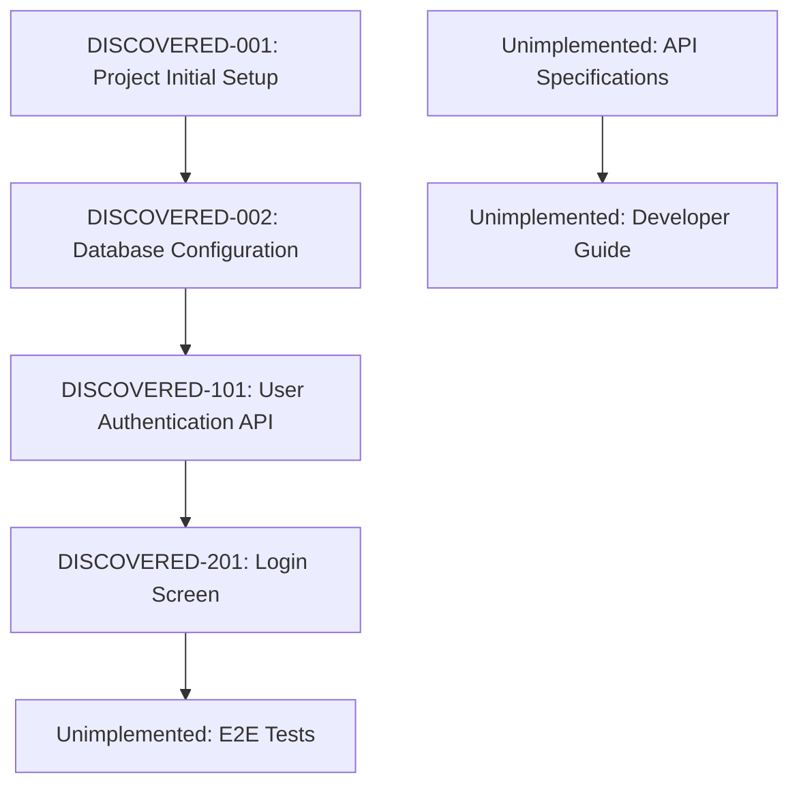

# rev-tasks

## Purpose

Analyze existing codebase to identify implemented features and organize them as a task list. Reverse-engineer task structure, dependencies, and implementation details from completed features and document them.

## Prerequisites

- Target codebase for analysis exists
- `docs/reverse/` directory exists (create if not present)
- Can analyze TypeScript/JavaScript, Python, and other code

## Execution Instructions

1. **Codebase Structure Analysis**
   - Understand directory structure
   - Verify configuration files (package.json, tsconfig.json, requirements.txt, etc.)
   - Analyze dependencies

2. **Functional Component Identification**
   - Frontend components
   - Backend services/controllers
   - Database related (models, migrations)
   - Utility functions
   - Middleware

3. **API Endpoint Extraction**
   - REST API endpoints
   - GraphQL resolvers
   - WebSocket handlers
   - Routing definitions

4. **Database Structure Analysis**
   - Table definitions
   - Relationships
   - Migration files
   - Index configurations

5. **UI/UX Implementation Analysis**
   - Screen components
   - State management implementation
   - Routing
   - Styling approaches

6. **Test Implementation Verification**
   - Unit test existence
   - Integration test existence
   - E2E test existence
   - Test coverage

7. **Task Reverse Engineering and Organization**
   - Decompose implemented features into tasks
   - Automatic task ID assignment
   - Estimate dependencies
   - Estimate implementation effort

8. **File Creation**
   - Save as `docs/reverse/{project-name}-discovered-tasks.md`
   - Document discovered tasks in structured format

## Output Format Example

````markdown
# {Project Name} Discovered Task List

## Overview

**Analysis Date**: {analysis-execution-date}
**Target Codebase**: {path}
**Discovered Tasks**: {count}
**Estimated Total Effort**: {hours}

## Codebase Structure

### Project Information
- **Framework**: {used-framework}
- **Language**: {used-language}
- **Database**: {used-db}
- **Major Libraries**: {major-dependencies}

### Directory Structure
```
{directory-tree}
```

## Discovered Tasks

### Foundation・Configuration Tasks

#### DISCOVERED-001: Project Initial Setup

- [x] **Task Complete** (Implemented)
- **Task Type**: DIRECT
- **Implementation Files**: 
  - `package.json`
  - `tsconfig.json`
  - `.env.example`
- **Implementation Details**:
  - {discovered-configuration-content}
- **Estimated Effort**: {hours}

#### DISCOVERED-002: Database Configuration

- [x] **Task Complete** (Implemented)
- **Task Type**: DIRECT
- **Implementation Files**: 
  - `src/database/connection.ts`
  - `migrations/001_initial.sql`
- **Implementation Details**:
  - {discovered-db-configuration-content}
- **Estimated Effort**: {hours}

### API Implementation Tasks

#### DISCOVERED-101: User Authentication API

- [x] **Task Complete** (Implemented)
- **Task Type**: TDD
- **Implementation Files**: 
  - `src/auth/auth.controller.ts`
  - `src/auth/auth.service.ts`
  - `src/auth/jwt.strategy.ts`
- **Implementation Details**:
  - Login/logout functionality
  - JWT token generation
  - Authentication middleware
- **API Endpoints**:
  - `POST /auth/login`
  - `POST /auth/logout`
  - `POST /auth/refresh`
- **Test Implementation Status**:
  - [x] Unit Tests: `auth.service.spec.ts`
  - [x] Integration Tests: `auth.controller.spec.ts`
  - [ ] E2E Tests: Not implemented
- **Estimated Effort**: {hours}

### UI Implementation Tasks

#### DISCOVERED-201: Login Screen

- [x] **Task Complete** (Implemented)
- **Task Type**: TDD
- **Implementation Files**: 
  - `src/components/Login/LoginForm.tsx`
  - `src/components/Login/LoginForm.module.css`
  - `src/hooks/useAuth.ts`
- **Implementation Details**:
  - Login form
  - Validation functionality
  - Error handling
- **UI/UX Implementation Status**:
  - [x] Responsive design
  - [x] Loading states
  - [x] Error display
  - [ ] Accessibility: Partially implemented
- **Test Implementation Status**:
  - [x] Component Tests: `LoginForm.test.tsx`
  - [ ] E2E Tests: Not implemented
- **Estimated Effort**: {hours}

## Unimplemented・Improvement Recommendations

### Missing Tests

- [ ] **E2E Test Suite**: Tests for major user flows
- [ ] **Performance Tests**: API response time tests
- [ ] **Security Tests**: Authentication・authorization tests

### Code Quality Improvements

- [ ] **TypeScript Type Safety**: Use of any type in some places
- [ ] **Error Handling**: Unified error processing
- [ ] **Log Output**: Structured logging implementation

### Documentation Gaps

- [ ] **API Specifications**: OpenAPI/Swagger not implemented
- [ ] **Developer Guide**: Setup procedure manual
- [ ] **Deployment Manual**: Production environment setup procedures

## Dependency Map



## Implementation Pattern Analysis

### Architecture Patterns
- **Implementation Pattern**: {discovered-pattern}
- **State Management**: {used-state-management}
- **Authentication Method**: {implemented-authentication-method}

### Coding Style
- **Naming Conventions**: {discovered-naming-conventions}
- **File Organization**: {file-organization-pattern}
- **Error Handling**: {error-handling-pattern}

## Technical Debt・Improvement Points

### Performance
- {discovered-performance-issues}

### Security
- {discovered-security-issues}

### Maintainability
- {discovered-maintainability-issues}

## Recommended Next Steps

1. **Implement Missing Tests** - Especially E2E test suite
2. **Documentation Organization** - API specifications and setup guide
3. **Code Quality Improvement** - TypeScript type safety and error handling
4. **Security Enhancement** - Detailed review of authentication・authorization

````

## Automatic Detection of Analysis Target Files

### Frontend
- React: `*.tsx`, `*.jsx`, `*.ts`, `*.js`
- Vue: `*.vue`, `*.ts`, `*.js`
- Angular: `*.component.ts`, `*.service.ts`, `*.module.ts`

### Backend
- Node.js: `*.ts`, `*.js` (Express, NestJS, etc.)
- Python: `*.py` (Django, FastAPI, etc.)
- Java: `*.java` (Spring Boot, etc.)

### Database
- SQL: `*.sql`, `migrations/*`
- ORM: Model files, configuration files

### Configuration Files
- `package.json`, `tsconfig.json`, `webpack.config.js`
- `requirements.txt`, `Pipfile`, `pyproject.toml`
- `pom.xml`, `build.gradle`

## Command Execution Examples

```bash
# Analyze current directory
claude code rev-tasks

# Analyze specific directory
claude code rev-tasks --path ./backend

# Analyze focusing on specific technology stack
claude code rev-tasks --tech react,nodejs

# Detailed analysis (including test coverage)
claude code rev-tasks --detailed

# Specify output format
claude code rev-tasks --format json
```

## Post-Execution Verification

- Display number of discovered tasks and estimated effort
- Display list of implemented/unimplemented features
- Display summary of technical debt・improvement recommendations
- Suggest next reverse engineering steps (design document generation, etc.) 